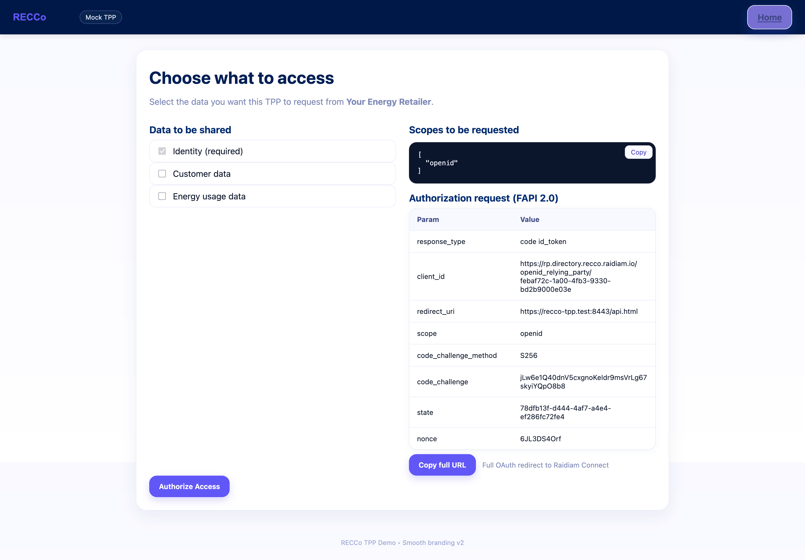
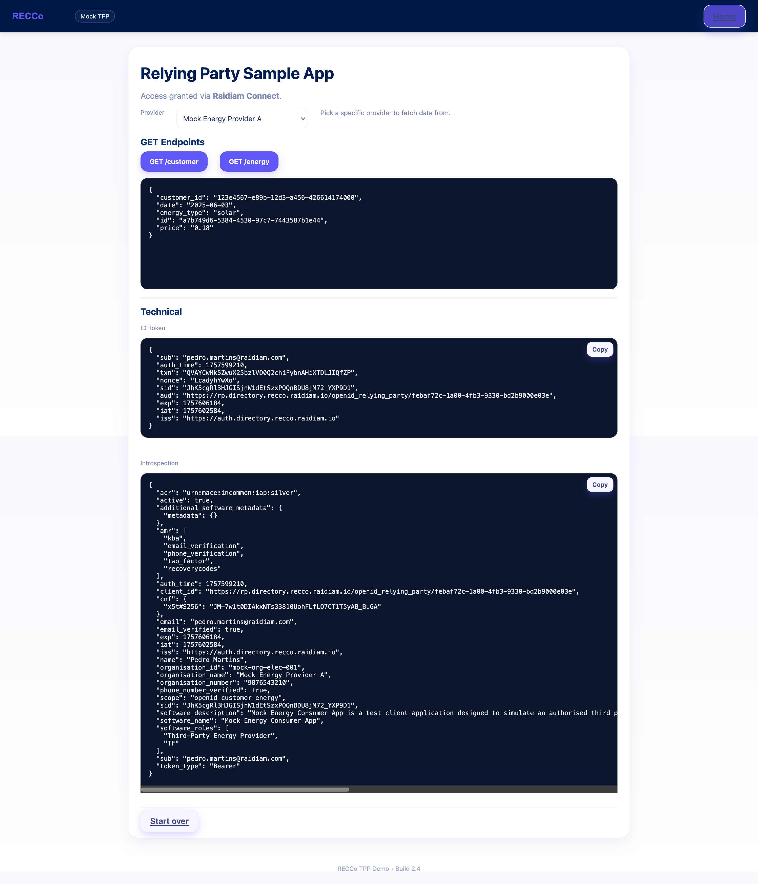

# RECCo Mock TPP

RECCo Mock TPP is a simple app that acts as a Third Party Provider for the RECCo environment. The application consists of two screens. On the first screen, the authorisation step (FAPI 2.0 compliant) is configured and the authorisation URI is generated according to the scopes selected by the user. The second screen is accessed after redirection and offers the possibility to request different APIs from providers participating in the environment.

## Requirements

- Docker and Docker Compose
- [`mkcert`](https://github.com/FiloSottile/mkcert) (to generate a trusted local HTTPS cert)
- Valid mTLS certs issued by the directory:
  - `certs/client.pem`
  - `certs/client.key`
  - `certs/ca.pem` - This should contain the full chain with the root CA at the bottom and the Issuing CA at the top. These can be sourced from `https://repository.pki.recco.raidiam.io/root-ca.pem` and `https://repository.pki.recco.raidiam.io/issuer-ca.pem`.
- A private signing key from the directory that will be used to sign the request object for PAR endpoint and client assertions:
  - `certs/server.key`

## Quick Start (w/ Docker and Makefile)

### 1) Add a local host name
- For macOS/Linux: edit `/etc/hosts` (with `sudo`)
- For Windows: edit `C:\Windows\System32\drivers\etc\hosts` (open as administrator)

Then add the following line to the `hosts` file:
```text
127.0.0.1 recco-tpp.test
```

### 2) Generate dev HTTPS certs
First, make sure you have `mkcert` installed (easy to install, follow instructions: https://github.com/FiloSottile/mkcert?tab=readme-ov-file#installation). Then, using the provided `Makefile` you can run:
```bash
make devcerts
```

Else, you can do it manually if you prefer:
```bash
mkcert -install
mkcert -cert-file devcerts/recco-tpp.test.pem -key-file devcerts/recco-tpp.test-key recco-tpp.test
```

Either way, the following files will be created:
- `devcerts/recco-tpp.test.pem`
- `devcerts/recco-tpp.test-key`

### 3) Place your mTLS directory certs
Create a `certs` folder in the project root and add your client certificate, client key and CA to it:
- `certs/client.pem`
- `certs/client.key`
- `certs/ca.pem`

These are mounted read-only into the container. The TPP is pre-configured for [Mock Energy Provider A, Mock TPP](https://web.directory.recco.raidiam.io/organisations/mock-org-elec-001/softwarestatements/0df6c9c3-a41d-49a6-8daf-bc9bc63126a3), so certificates should be configured in this software statement.

For more information on how to obtain your certificates, refer to this [guide](https://www.raidiam.com/developers/docs/how-tos/certificates/manage-application-certificates). An `rtstransport` certificate must be used for the mTLS connection and a `resource_server_

### 4) Place your signing key inside `certs` folder
In the same folder you added the client certificates and key, you should add the private signing key:
- `certs/server.key`
You should check the `kid` associated with this key in the directory. It will be used in the next step.

### 5) Run
```bash
make up KID=<your-kid>
```

Then open https://recco-tpp.test:8443/index.html.

## Local Development (non-Docker)
You can still run locally if you prefer:

1. Follow steps 1), 2), 3), and 4) from Quick Start (w/ Docker and Makefile)
2. Set an `.env` file in the root of the project with:
    ```dotenv
    LISTEN_ADDR=:8443
    APP_ORIGIN=https://recco-tpp.test:8443
    REDIRECT_URI=https://recco-tpp.test:8443/api.html

    WELL_KNOWN_URL=https://auth.directory.recco.raidiam.io/.well-known/openid-configuration
    CLIENT_ID=https://rp.directory.recco.raidiam.io/openid_relying_party/0df6c9c3-a41d-49a6-8daf-bc9bc63126a3
    PARTICIPANTS_URL=https://data.directory.recco.raidiam.io/participants

    MTLS_CERT_FILE=./certs/client.pem
    MTLS_KEY_FILE=./certs/client.key
    MTLS_CA_FILE=./certs/ca.pem

    DEV_TLS_CERT_FILE=./devcerts/recco-tpp.test.pem
    DEV_TLS_KEY_FILE=./devcerts/recco-tpp.test-key

   SIGNING_KEY_FILE=./certs/server.key
   SIGNING_KEY_ID=<your-kid>
    ```
3. Run the server (pick one):
   - **Recommended**: `make run-local`
   - **Alternatively**: export variables yourself and run: `export $(grep -v '^#' .env | xargs) && go run ./cmd/server`

4. Open https://recco-tpp.test:8443/index.html

## UI Flow (and what's happening behind the scenes)

### Screen 1 - `index.html` (Scopes and Authorisation URL)



- You can choose scopes (`openid` (always sent), `customer`, `energy`).
- **Copy full URL** button copies the exact redirect URL generated.
- **Authorize Access** button makes the redirection to directory auth with the generated URL (login -> consent).
- In the first page, the server:
  - Fetches `OpenID Discovery` from `WELL_KNOWN_URL` and caches it.
  - Generates `PKCE` (`verifier` + `challenge`), `state`, and `nonce`.
  - When clicking in either button, the PAR endpoint is called with the parameters shown in the UI and the authorization URL is built based on the PAR endpoint response.
  - Sets a session cookie with the `verifier`/`state`.

### Screen 2 - `api.html` (Token, Providers, and API calls)



- Callback takes us to this screen after directory redirection
- The server calls `POST /auth/token`:
  - Uses mTLS (w/ directory certs) to `POST` to the mtls token endpoint (fetched from the discovery endpoint).
  - Sends `grant_type=authorization_code`, `code`, `redirect_uri`, `code_verifier`, `client_assertion`, and `client_assertion_type`. The `client_assertion` is signed with the private key.
  - Stores the `access_token` in the server-side session.
  - If `mtls.instrospection_endpoint` is present, it calls `POST { token, client_assertion, client_assertion_type }` and returns the result.
- Providers dropdown: it is populated via `GET PARTICIPANTS_URL`, the result is a filtered list of all the authorisation servers that contains resources for both `customer` and `energy` APIs. The names displayed are their `CustomerFriendlyName`.
- `GET /customer` and `GET /energy`:
  - Resolves the discovery endpoint host for the selected provider and family (`recco/customer/v1/customer` or `recco/energy/v1/energy`).
  - Calls with mTLS and `Authorization: Bearer <access_token>`.
  - Renders JSON in the result panel.
- ID Token box: it shows the decoded `id_token` payload that came from the token creation step.
- Introspection box: raw JSON payload from the introspection endpoint (or an error ir unavailable).

## License

MIT - see [LICENSE](./LICENSE) for details.
